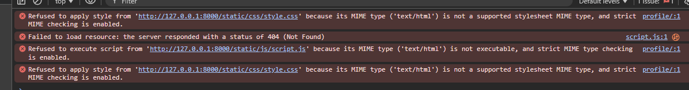

### 8. Debugging

Below are the various bugs that I encountered along the way and how I fixed them. In ever first instance, I would consult with chatGPT to see if it could help me fix the bug. As it is now becoming more common place to use ChatGPT for debugging in the industry, I decided that it would be good practice to use it as a tool to help me debug. For clarity and ease of use, I have broken the bugs down into the following categories:

- **Syntax Errors**
- **Logic Errors**
- **Runtime Errors**
- **Semantic Errors**
- **Design Errors**
- **Other Bugs**
- **Bugs Unresolved**

#### 8.1 Syntax Errors

  - **Bug:** Incorrect spelling of module name. 
  
  The error occured when I was importing the first module in the project. The module name was misspelled in the import statement. What had happened was that I had pluralised the app name (gig_reviews) and then created the class  name (GigReview) using the singular form of the model name. This caused the error when trying to migrate the module to the database.
  
  - **Fix:** Corrected the spelling of the class module name in app.py, admin.py and urls.py to correspond with the app pluralisation and the class singular. 

  - **Lesson Learned:** It is important to be consistent with the naming conventions used in the project. 
  
  This will help to avoid errors such as this one in the future by creating different classes for the singular and plural forms of the model name. More importantly to make sure that I use different names for the app name and the class name to avoid confusion.

  - **Bug:** While integrating Cloudinary into my Django project, I encountered a TypeError when using os.environ.setdefault() in my env.py file. I had mistakenly passed only one argument instead of the required key-value pair. After correcting that, a second issue appeared — an IndentationError in settings.py. I had written an if statement to check for the presence of env.py but forgot to indent the import env line beneath it, which prevented the project from running.
  
  - **Fix:**  I resolved the TypeError by replacing setdefault() with a direct environment variable assignment. I then resolved the IndentationError by indenting the import env line so it sat within the if block.

  - **Lesson Learned:** Syntax errors like these can completely stop Django from running, even if the actual mistake is minor. I was reminded to pay close attention to indentation, especially in conditional blocks, and to always check that function calls are written with the correct number of arguments. Stepping through each issue methodically helped isolate and fix the problems without getting overwhelmed by the complexity of the project.
  
### 8.2 Logic Errors

- **Bug:** Sign-up, login and logout templates not loading on server. After checking my template structure multiplue times I could not understand why the templates were not loading. I had checked the urls.py file and the views.py file and they were both correct. I then realised that I had created the template and registration folders at the wrong level. This was a simple mistake but it took me a while to figure out.

- **Fix:** Moved template and registration folders to the root level of the project and left the signup html file in the app level templates folder.
  
- **Lesson Learned:** Double check everything I do and make sure that I am using the correct logic and placement of my template folders.

- **Bug:** When I selected "Fan", "Artist", or "Venue" from the dropdown on my contact page, nothing happened. The correct form didn’t appear. I expected that choosing a contact type (e.g. "Fan") would show only the fan form and hide the other two, like it was doing earlier in testing.

- **Fix:** The JavaScript function existed and didn’t crash, but it ran at the wrong time — before the dropdown element was ready. That meant the logic didn’t produce the expected result (the form showing), even though the code had no syntax errors. Thus, I wrapped it using DOMContentLoaded to ensure it ran only after the page was loaded.

- **Lesson Learned:** I learned that it’s important to test my code thoroughly, even if it seems to work. I also learned that it’s important to understand the logic of my code and how it interacts with the DOM, and that JavaScript can’t find or interact with HTML elements unless the page is fully loaded first.

- **Bug:** The delete confirmation popup stopped appearing when I clicked the “Delete Profile” button. This happened after I moved my static files to a global directory. There were no errors in the Django server output, so I initially assumed the problem was with the JavaScript logic itself.

- **Fix:**  I reviewed my base.html template and found that I hadn’t updated the path to the JS file after moving it. I had been using a hardcoded path like /static/js/script.js, but Django wasn’t recognizing it. I replaced it with the correct  tag:

    

- **Leason Learned:** If JavaScript code isn’t running, always verify whether the script is actually being loaded by checking the console. A console.log() at the top of the file is a quick way to test this. Also, whenever static file paths are changed or files are moved, it's important to update all related template references using  rather than hardcoded paths, especially when working within Django.

### 8.3 Runtime Errors

- **Bug:** Runtime error when trying to migrate the database.
Django's migration history didn’t match the actual state of the database. It tried to create a table that already existed after I had added the fields 'location' and 'website' to the profile model and change the field's name from 'highlight' to 'title'. I got the following error message:

  psycopg2.errors.DuplicateTable: relation "gig_reviews_gigreview" already exists
  psycopg2.errors.UndefinedColumn: column "highlight" does not exist

- **Fix:** I used the following command to python manage.py migrate gig_reviews --fake 0001. This command faked the first migration where the table has all ready migrated and skipped the migration history. This allowed me to make the changes to the database and then run the migrations again. I had to repeat this process for the other two migrations (0002 for the change to the field 'highlight' to 'title'and 0003 for the addition of the 'location' and 'website' fields).

- **Lesson Learned:** Always check the migration history before making changes to the database.

- **Bug:** JS delete confirmation not triggering when clicking the "Delete Profile" button. The issue was created when I moved my static    file location from my app to my global settings. However, there were no errors in the Django server output. So in order to diagnose why the JS was not working, I a console log to the top on my js file to say "script.js loaded!". As this was not appearing in the console in DevTools, I knew that the JS was not being loaded.
  
- **Fix:** I retraced my steps and found that I had not rerouted my script src in my base.html. I moved the static file location from 'my app/' and changed the path in the html file to the global location.
  
- **Lesson Learned:** Always check the console for errors and make sure that the JS is being loaded correctly before moving on with the project assuming that the error is not in the JS. I left the console.log at the top of my Js file as a reminder to check the console for errors at each step of the way.

- **Bug:** After moving my static files (CSS and JavaScript) from an app-level directory to a global static/ folder, the browser console reported MIME type errors and 404 responses for both style.css and script.js. Despite the files existing in the correct location, Django was returning HTML instead of the expected static file content. There were no errors in the Django server log, which made the issue harder to diagnose. The CSS and JS files were not being applied or executed at all.

- **Fix:** I first confirmed that my file structure and template paths were correct using . Then I ran python manage.py findstatic css/style.css, which confirmed Django could locate the file. This pointed to the fact that Django simply wasn’t serving the static files during development. To fix this, I updated urls.py to explicitly serve static files by adding the following block at the bottom of the file:

    from django.conf import settings
    from django.conf.urls.static import static

    if settings.DEBUG:
        urlpatterns += static(settings.STATIC_URL, document_root=settings.STATICFILES_DIRS[0])

- **Lesson Learned:** Always check the console for errors and make sure that the JS is being loaded correctly before moving on with the project assuming that the error is not in the JS. I left the console.log at the top of my Js file as a reminder to check the console for errors at each step of the way.

Even when static files exist and are referenced correctly in templates, Django won’t serve them during development unless explicitly told to. It’s important to use findstatic to confirm the path and then make sure the urls.py is properly configured. MIME errors in the browser usually indicate that something is being returned with the wrong content type — often a 404 HTML page — so checking the browser’s DevTools network tab is an essential part of debugging static file issues.

- **Bug:** I had written the SearchForm class in forms.py but mistakenly tried to import it from models.py and got an ImportError caused by trying to import SearchForm from the wrong file.

  ImportError: cannot import name 'SearchForm' from 'gig_reviews.models' (C:\Users\axdek\Documents\vscode-projects\Project 3\Praise-The-Loud\gig_reviews\models.py)

- **Fix:** I fixed the bug by importing the SearchForm class from forms.py instead of models.py by updating the import statement in views.py.

- **Lesson Learnes:** Always import classes from the correct file. This was a simple mistake but it took me a while to figure out what was causing the error, but I used the trace back to identify the issue.

- **Bug:** Django threw a TemplateDoesNotExist error when loading the search results page. I had already created the search_results template in the templates folder, but I had not routed it in the views correctly.

- **Fix:** I fixed the render call in the view to point th the correct folder.

- **Leason Learned:** Always check the render call in the view to make sure that the template is being rendered correctly, like this:

    return render(request, *'gig_reviews/search_results.html'*, {'form': form, 'results': results})

### 8.4 Semantic Errors

- **Bug:** This bug continued throughout my project: spelling mistakes in the HTML, CSS, Js and Python code. I had to spend a lot of time debugging and fixing these errors.
  
- **Fix:** I used the following command to python manage.py check --deploy. This command checks for common errors in the project. It also checks for spelling mistakes in the HTML, CSS, Js and Python code.

- **Lesson Learned:** ALWAYS check the spelling of everything as you go along. This will save you a lot of time in the long run.

- ***Bug:** After deploying to Heroku, the contact form did not appear when selecting "Fan", "Artist", or "Venue". The modal buttons were unresponsive, even though everything worked correctly in local development.

- **Fix:** I Opened Chrome DevTools and saw multiple MIME type and 404 errors in the Console. Heroku was serving the JavaScript and CSS files as HTML instead of the correct MIME types because collectstatic was not running, and WhiteNoise was not configured to serve static files. These were the steps taken to fix the issue at the bottom of the settings.py file:

    Added *'STATIC_ROOT = BASE_DIR / "staticfiles"'*
    Installed *'whitenoise'* in *'MIDDLEWARE'*
    Set *'STATICFILES_STORAGE = "whitenoise.storage.CompressedManifestStaticFilesStorage"'*
    Removed *'DISABLE_COLLECTSTATIC = 1'* from *'Heroku'*
    Committed all changes and dep[loyed succefully after verifying *'collectstatic'* ran]

 **Lesson Learned:** Heruko does nto serve static files out of the box. I need to set the *'STATIC_ROOT'* correctly, use *'whitenoise'* to handle the static assets in production, and confirm that *''* is linked in my CSS and JavaScript files. Using DevTools to inspect the network tab and check for MIME errors is also helpful.

### 8.5 Design Errors

- **Bug:**
- **Fix:**
- **Lesson Learned:**

### 8.6 Other Bugs

**Field error**

- **Bug:** The website links weren't showing up in the search results, even though the template had the correct code and the values were entered via the admin panel.
  
- **Fix:** I descovered that the field in both the Artist and Venue models were misspelled 'webbsite' instead of 'website'. I corrected the spelling in both models and then ran 'makemigrations' and 'migrate' to update the database.
  
- **Lesson Learned:** Model field typos don’t raise obvious errors — they just silently break things in views and templates. Always double-check the spelling of everything as you go along. This will save you a lot of time in the long run.

**Validation Error**

- **Bug:** Submitting the gig review form gave an error saying "Enter a valid date," even though the date was selected using the calendar input. The form would not save. I had previously changed the date format in my settings file to *'DD-MM-YYYY'*, so I knew that wasn't the issue.
  
- **Fix:** The form was using *'<input type="date">'*, which submits dates in *'YYYY-MM-DD'* format. However, the form's *'input_formats'* was incorrectly set to expect *'DD-MM-YYYY'*. I corrected the *'input_formats'* to *'%Y-%m-%d'* and the form started working correctly, as I had previously add the init method, of the form class, as *'%d-%m-%Y'*.
  
- **Lesson Learned:** When using *'<input type="date">'*, in a form widget, always expect *'%Y-%m-%d'* as the input format. The browser handles formattting, but Django needs to know the exact formatting being submitted.

**Version Control Issue**

- **Bug:** After committing several changes locally (including fixes for static files), the *'git push heroku main:main'* command returned "Everything up-to-date", but Heroku kept failing with the same STATIC_ROOT error. It became clear that Heroku was not building from the latest local code. I had made a mistake in my local git repository, which caused a merge conflict when I tried to push my changes to GitHub.

- **Fix:** I had to merge the changes from the main branch into my local branch, resolve the merge conflict, and then push the changes to GitHub.

- **Lesson Learned:** Always make sure your local git repository is up-to-date with the main branch before pushing changes to GitHub.

**Validation Styling**

- **Bug:** I wanted to replace Django's default password help text with a custom set of *'
'* tags so that the styling would match the entire he sign up form. I tried overring the *'self.fields["password1"].help_text'* using *'password_validators_help_texts()'*, but Django still rendered the original *'<ul><li>'* help list. I decided to rollback and avoid customizing the form too deeply, as the logic behind Django's password validation system felt too complex to change confidently and I started to break my code.

- **Fix:** I rolled back to using Django’s built-in *'UserCreationForm'* and left the default help text rendering untouched. Instead of replacing the HTML structure, I used CSS to remove the bullets, collapse the spacing, and visually match the default help list with the rest of the form. This gave me full control over the appearance without needing to override the form logic or validators.

**Lesson Learned:** Not every problem needs a code-level fix. Sometimes it's better to work with Django’s defaults and solve presentation issues using CSS. This approach is simpler, more maintainable, and avoids breaking built-in functionality — especially when the underlying logic is complex or abstracted away.

### 8.7 Bugs Unresolved

- **Bug:** I wanted to change the highlight color that appears when selecting or hovering over options in a native *'<select>'* dropdown. My goal was to make the selection styling match the custom color scheme used across the rest of the site.

- **Fix:** This could not be fixed using standard CSS. Most modern browsers (especially Chrome, Safari, and Firefox) render *'<select>'* dropdowns and their option lists using native OS UI components, which are not styleable via CSS. I considered rebuilding the dropdown as a fully custom component using JavaScript and HTML, but chose not to pursue this due to the added complexity and time constraints.

- **Lesson Learner** Some UI elements like native *'<select>'* options are outside the scope of CSS styling due to how browsers and operating systems render them. In these cases, it’s better to accept the default behavior or switch to a fully custom solution — which may not be worth it if the rest of the experience is consistent and functional.

