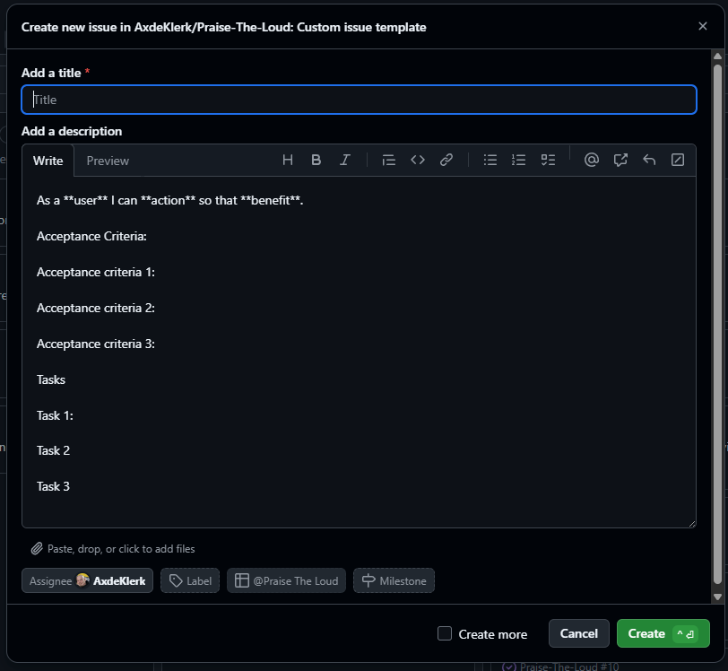
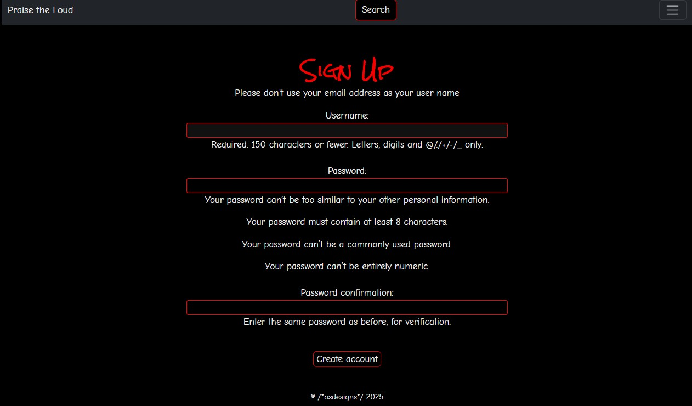
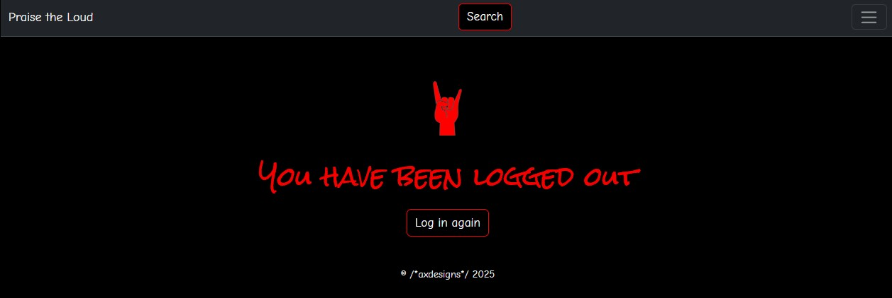

# Praise-The-Loud

# Table of Contents

1 Introduction

[1.1 Project Goal](#project-goal)  
[1.2 Target Audience](#target-audience)  
[1.2.1 User Stories](#user-stories)  
[1.3 Site Aim and Purpose](#site-aim-and-purpose) 

2 Planning and Development
 

[2.1 Entity Relationship Diagram](#erd)  
[2.2 Wireframes](#wireframes)  
[2.3 Colour Palette]()  
[2.4 Typography]()  
[2.5 Agile Metodologies]()

3 Features

[3.1 Home Page](#home-page)  
[3.1.1 Navbar](#navbar)  
[3.1.1.1 User Greeting](#user-greeting)  
[3.2 About Page](#about-page)  
[3.3 Wall of Chaos](#wall-of-chaos)  
[3.3.1 Chaos Cards](#chaos-cards)  
[3.3.1.2 Author's Page](#author's-page)  
[3.3.1.3 Fan's Profile Page](#fan's-profile-page)  
[3.3.1.4 Venue's Page](#venue's-page)  
[3.4 Signup Page](#signup-page)  
[3.4.1 Help Text and Error Messages](#help-text-and-error-messages)  
[3.5 Login Page](#login-page)  
[3.6 Profile Page](#profile-page)  
[3.6.1 Update Profile Page and form](#update-profile-and-form)  
[3.6.2 Update Profile Photo](#update-profile-photo)  
[3.6.3 Delete Profile Function](#delete-profile-function)  
[3.6.4 Manage Reviews Button and Update Form](#manage-reviews-button-and-update-form)  
[3.6.4.1 Review Update and Cancel Buttons and Functionality](#review-update-and-cancel-buttons-and-functionality)  
[3.7 New Gig Review Page and Form](#new-gig-review-page-and-form)  
[3.8 Logout Page](#logout-page)  
[3.9 The Contact Page and Forms](#the-contact-page-and-forms)  
[3.9.1 Fan Form](#fan-form)  
[3.9.2 Artist Form](#artist-form)  
[3.9.3 Venue Form](#venue-form)  
[3.10 The Search Bar and Functionality](#the-search-bar-and-functionality)  
[3.10.1 Search Results](#search-results)  
[3.10.2 Artist Results](#artist-results)  
[3.10.3 Venue Results](#venue-results)  
[3.10.4 No Results](#no-results)
[3.11 Footer](#footer)
[3.12 404 and 500 Error Pages](#312-404-and-500-error-pages)

4 Debugging, Testing, Deployment and Future Developments

[4.1 Debugging](#debugging)  
[4.2 Testing](#testing)  
[4.3 Deployment](#deployment)  
[4.4 Future Devlopments](#future-developments)

5 Credits and Acknowledgements

[5.1 Credits](#credits)  
[5.2 Acknowledgements](#acknowledgements)

## 1 Introduction

Praise the Loud has been designed as a one-of-a-kind gig review website that allows fans to add their own personal gig reviews, to celebrate all that the home grown artisits and venues do for emerging rock and metal music. By creating a profile they have access to the gig review form to create their own reviews for gigs that they have attended. If a fan chooses not to create a profile they can still browse other fan's reviews and search by artist or venue to give them a flavour of opinion, from those who do have a profile. It also serves the artists and the venues to see what fans think of them. By actively engaging with the site (no matter how users choose do it) the idea is to promote all that is loud!

### 1.1 Project Goal

The ultimate goal of the project is to create a website that is visually appealing, enjoyable to engage with, light-hearted and simple to use so as not to detract from the aim and objective of the website: to discover new music and celebrate the ones you already love.

### 1.2 Target Audience 

The target Audience for this website are fellow rock and metal heads and fans. More specifically people who enjoy going to independent rock and metal festivals, that showcase emerging British bands, artists and venues that support them.

### 1.2.1 User Stories 

Below are the user stories in a consistent format of: As a **[user type]**, I want **[a feature]** so that **[a benefit or outcome]**. They have been grouped under the MoSCoW method categories: Must-Have, Should-Have and Could-have.

#### Must-Have:

- As a visitor, I want to view a functioning homepage so that I understand the purpose and layout of the site
- As a new user, I want to register for an account so that I can access the gig reviews form to leave a review
- As a registered user, I want to log in and view my profile so that I can see and manage my activity
- As a fan, I want to write a gig review so that I can share my experiences with others and engage with the artists to celebrate their music
-  As a fan, I want to search reviews by artist or venue so that I can find specific performances
-  As a user, I want intuitive navigation so that I can move easily between sections of the site
-  As a user, I want to choose what to be able to use any screen or device view to optimised my experience
-  As a user, I want to feel confident that website I'm using aligns with the genre I love (*brand identity*)
-  As a user, I want my username to be validated clearly during signup so that I avoid registration errors
-  As a user, I want any errors in forms to be visibly displayed so that I can fix them before submission
-  As a user, I want a reliable submit button so that I can confidently complete forms without failure
-  As a visitor, I want to read an About section so that I understand the site's mission and who it's for
  
#### Should-Have:

-  As a fan, I want to view and edit my profile page so that I can update my details
-  As a fan, I want to edit or delete my own reviews so that I can correct or remove content if needed
-  As a fan, I want to see a gallery view of all fan reviews so that I can browse other fan's reviews
-  As a user, I want to upload review images smoothly so that media enhances my post without frustration
-  As an artist or venue, I want to collaborate with the site team so that I can manage my presence or correct info
-  As a fan, I want to search for reviews specifically linked to artists or venues so that I can find the right content
-  As a user, I want to search for artists by venue so that I can find performances that took place there
-  As a fan, artist, or venue, I want to contact the site so that I can ask questions or provide feedback

#### Could-Have:

- As a fan, I want to suggest a missing band so that the platform includes all artists I care about

### 1.3 Site Aim and Purpose

The aim and the purpose of this website is to provide a real-time platform for fans to engage with the rock and metal  artists we love and venues that promote them. Too often fans don't have access to artists after the gig due to the crowds that gather around the artists at the end. Although the artists encourage fans to come and see them, too many fans do not get the opportuntiy to tell the artists how much their music means to them.

## 2 Planning and Development

### 2.1 ERD (Entity Relationship Diagram)

The ERD was designed using [draw.io](https://app.diagrams.net/) to show the relationship between the different entities in the database.

### 2.2 Wireframes

The wireframes were drawn using Balsamic. Both the larger screen and the mobile version were created at the same time. This allowed for a greater design initiative which took into account the overall layout of the website and how I wanted it to look on both screens. The wireframes were used throughout the design of the website and went through various iterations until the final product was decided upon.
 

### 2.3 Colour Palette

The colour palette chosen is the typical colour scheme of the rock and metal scene: red, white and black. However, I change the 'white' for a softer shade of light grey (#F5F5F5) so that it wasn’t so stark on the eyes and doesn't cause blurring and bleeding into the black or red. The red (#F50000) was chosen to reduce the brightness of the red and a dark grey (#5C5C5C) was chosen for the navigation bar so that it had prominance on the black background. 

The colours chosen from using this pallet from [coolors.co](https://coolors.co/):

  

### 2.4 Typography

The typography was chosen from *Google Fonts*. All headings are in 'Rock Salt' and the remainder of the text in the both uses 'Comic Neue', with sans-serif as the fall back. The desired effect was to mirror a blackboard style handwriting to give the idea that everything is handwritten and personal, echoing the spirit of the site as seen here in the About page snip:

### 2.5 Agile Methodologies

This project was developed using Agile methodologies to ensure a user-focused, iterative, and flexible development process. Key Agile principles were applied throughout, including:

#### User Story-Driven Development

The project was guided by clearly defined user stories based on real user goals and expectations. Stories were written in the format: “As a [user], I want [feature] so that [benefit]". This ensured that all development decisions were tied directly to user needs.

#### Kaban board

A "Kanban" board (created in *GitHub* Projects) was used to plan, track, and manage tasks. Columns such as "Backlog", "In Progress", "In Review", "Done", and "Future Development" were used to organise and visualise the workflow. Each card represented a single user story or development task.

A blank template was first created in *Github* Issues that set the structure for each user story, as shown here:

Here is a representation of the *Kaban* board in use:

## 3. Features

### 3.1 Home Page

The landing page welcomes fans into a space designed with grit and soul — a tribute to the culture we love. It sets the tone for everything that follows, inviting users to explore the music, the reviews, and the voices that live beyond the stage. In equal measures our comminty enjoys, good company, good beer, good music and good humour. This has been reflected in the title.

### 3.1.1 Navbar

A clean, responsive navbar floats atop every page, making it easy to navigate between gigs, artists, venues, and contact points. It reflects the project’s core aim: to let fans focus on expression, not confusion.

### 3.1.1.1 User Greeting 

Once logged in, users are greeted by name — a simple but intentional gesture that recognises the fan behind the screen. It personalises the experience and reinforces the idea that every fan voice matters here.

### 3.2 About Page 

This page captures the project’s ethos: uncensored and unfiltered, but not without boundaries. While it gives fans space to speak freely, it holds to the genre’s code — respect in rebellion, honesty without abuse.

### 3.3 Wall of Chaos 

A visual wall of fan voices — unfiltered, raw, and celebratory. The Wall of Chaos turns the fanbase into the gallery, a space where your memories and moments from the gig live on, shared with the world that understands.

### 3.3.1 Chaos Cards 

Each chaos card captures a fan review in snapshot form — slanted, vibrant, and ready to be hovered over. This playful randomness reflects the joy of live music and keeps the design energetic, just like a packed-out pit.

### 3.3.1.2 Author's Profile Page 

Fans can click through to read more about the author of any review. These mini profiles help turn strangers into a community, giving faces to usernames and voices to passionate stories. Author's have a dedicated space that displays every gig they’ve reviewed — a personal archive of connection. This space belongs to them, echoing the project’s goal of honouring fan perspectives without distraction.

### 3.3.1.3 Artist's Page 

Each artist has a dedicated page that gathers all fan reviews written about them. It gives bands a place to see the love in one space — uncensored, unfiltered, and fan-powered. For users, it’s a way to revisit their favourite acts or discover new ones through the eyes of fellow rock and metal heads.

### 3.3.1.4 Venue's Page 

Venues get the spotlight too, with pages that pull together every fan review posted about them. It recognises the role of grassroots spaces in nurturing this scene and gives fans a way to celebrate the places that welcomed them.

### 3.4 Signup Page

The signup process is quick, simple, and clearly validated — lowering the barrier to entry so fans can jump straight into the music and memory-sharing. No noise, no gimmicks, just easy access to the space.

### 3.4.1 Help Text and Error Messages

Helpful messages guide users through the form, ensuring clarity without ever making fans feel unwelcome or wrong. This is about building confidence, without any complicated barriers.

### 3.5 Login Page

The login screen keeps it straightforward and sleek — just like the experience it unlocks. Once inside, fans can review, explore, and take part in the scene that brought them here.

###  3.6 Profile Page 

The profile is the backstage pass — a personalised area that showcases the fan's reviews, photo, and engagement with the community. It’s designed to celebrate and give voice to the fans.

###  3.6.1 Update Profile Page and form

Fans can update their bio and details without hassle, giving them control over how they show up in the space. It keeps everything current and personal.

### 3.6.2 Update Profile Photo 

This is feature is more complicated that it needs to be and should definitely be developed in future iterations to be more simple. Unfortunately, the time and scope of this project did not allow for the necessary research into editing images without have to clear, update and then upload a new photo before the final update. Instructions on how to do this successfully are shown here:

### 3.6.3 Delete Profile Function 

While this project celebrates fan voices, it also respects autonomy. If someone wants to leave, they can do so simply. The size of the button here is deliberate to draw the user to its action/function so as not to confuse it with the update button.

Once clicked it returns a warning asking the user if they are sure they want to delete their profile.

Unfortunately, time and scope have not allowed the research needed to customise the delete pop-ups. Perhaps for a future irriteration.

### 3.6.4 Manage Reviews Button and Update Form

Each review can be revisited, edited, or improved. Fans are given the power to shape their own legacy, correcting the record if needed

### 3.6.4.1 Review Update and Cancel Buttons and Functionality 

With clearly labelled update and cancel options, fans are never locked in. Flexibility reigns — write when the passion hits, revise when needed. The delete button gives a warning asking the user if the really intend deleting - similar to  the profile delete above.

### 3.7 New Gig Review Page and Form

The review form is the beating heart of the site. It asks just what’s needed to share the experience: who played, where, when, and how it felt.

### 3.8 Logout Page

A simple, respectful exit. When users log out, they’re thanked and sent back to the homepage.

### 3.9 The Contact Page and Forms 

Fans, artists, and venues can all contact the owner/admin directly through the contact form. It ensures the site stays connected; fan-powered, but artist and venue friendly collaboration encouraged too.

There are 3 seperate forms. One for the fan, one for the artists and one for the venues. The idea to have 3 seperate forms for the different groups of people shows extra care and attention to the different group's needs. It personalises and therefore encourages contact as opposed to the usual, souless, contact forms on every website. All 3 are show here.

### 3.9.1 Fan Form 

Fans can leave feedback, ask questions, or reach out to the site admin. It’s part of the mission: to be heard not just by artists, but by the community itself.

### 3.9.2 Artist Form

Artists have their own form to use — a way to check their listings, respond to fan praise, or just say thanks. It reinforces the two-way connection that fuels this culture.

### 3.9.3 Venue Form

Venues can contact the site too, ensuring accuracy, building bridges, and staying in touch with the fans who filled their bars.

### 3.10 The Search Bar and Functionality

The search bar lets users look up reviews by artist or venue, streamlining the path to discovery. It supports the site's core goal: helping fans relive what they loved, or discover something new.

### 3.10.1 Search Results

Search results are clearly presented with the artist or venue at the top, followed by reviews. It’s all about clarity and accessibility.

### 3.10.2 Artist Results 

Artist results pages showcase all reviews associated with that act. It honours their place in the scene and creates a central hub for fan voices.

### 3.10.3 Venue Results

Venues receive similar treatment, collecting all reviews in one place. It reminds us that these spaces are more than rooms, they’re part of the story.

### 3.10.4 No Results

If nothing is found, fans are gently told, providing the option to try again

### 3.11 Footer

The footer is simply the copyright for the site. No additional promotion, sponsorship, or advertising. The space is not meant for anybody other than the rock and mwetal community who support emerging artists. It harnesses the 'outsider' ethos, spirit and character of the community.

### 3.12 404 and 500 Error Pages

Both the 404 and 500 error pages display error messages with the same level of humour carried throught the site. However, they are diffferent as they address the user error (404) and the serever error (500) differently making it clear where the error lies and what to do to correct them.

## 4 Debugging, Testing, Deployment and Future Developments

### 4.1 Debugging

Please refer to the debugging documentation for detailed descritions of all bugs found, fixed and learned from. It can be found here: [DEBUGGING.md](DEBUGGING.md)

### 4.2 Testing

Please refer to the testing documentation for detailed descritions of the tests completed found here: [TESTING.md](TESTING.md)

### 4.3 Deployment

This section outlines the full process for deploying this project from *GitHub* to your local machine using *VS Code*, and then hosting it live on *Heroku*.

#### Create a GitHub Repository

- Go to *GitHub* and click the "+" icon to create a new repository
- Name the repository and optionally add a description
- Choose "Public" or "Private"
- Do not initialize with a README, .gitignore, or license
- Click "Create repository"

#### Clone the Repository to VS Code

- Open *VS Code* and its terminal
- Navigate to the folder where you want your project
- Copy the repository's URL from *GitHub* and use the "Clone Git Repository" option in *VS Code*
- Open the project folder in *VS Code*
- 
#### Create and Activate a Virtual Environment

- In your terminal, create a virtual environment inside your project folder
- Activate the environment depending on your system (*Windows*, *Mac*, or *Linux*)
- Your terminal prompt will change to show the environment is active

#### Install Project Dependencies

- Use the requirements.txt file to install all necessary *Python* packages:

    -  *Django* – Core web framework for building the project
    -  *Gunicorn* – WSGI HTTP server for running *Django* on *Heroku*
    - *dj-database-url* – Parses the *Heroku* database URL into *Django* database settings
    -  *psycopg2-binary* – *PostgreSQL* database adapter for *Python*
    -  *whitenoise* – Serves static files efficiently in production
    -  *cloudinary* – Handles image uploads and storage
    -  *django-cloudinary-storage* – Integrates *Cloudinary* with *Django*'s media and static file handling
    - *django-allauth* – (Optional) For user authentication, if used

- If this file doesn’t exist yet, install your packages manually and then generate the file

#### Prepare the Project for Heroku

- Create a "Procfile" at the root of your project with the necessary *Heroku* command to run the app
- Ensure "gunicorn", "dj-database-url", and "psycopg2-binary" are installed
- Update your "requirements.txt" file with any new packages
- Commit all changes to *Git*

#### Set Up a Heroku Account and CLI

- Create an account at *Heroku.com*
- Download and install the *Heroku* CLI for your operating system
- Use the CLI to log into your *Heroku* account

#### Create a Heroku App

- Use the *Heroku* CLI to create a new app with a unique name
- *Heroku* will generate a remote *Git* URL for your project

#### Push Your Project to Heroku

- Add *Heroku* as a *Git* remote if it wasn’t automatically added
- Push your local codebase to *Heroku*’s remote repository

#### Configure Environment Variables on Heroku

- Go to your *Heroku* Dashboard and open your app
- Under "Settings", click "Reveal Config Vars"
- Add the following variables:
    - "DEBUG" = "False"
    - "SECRET_KEY" = your *Django* secret key
    - "ALLOWED_HOSTS" = your *Heroku* app's URL
    - Add any additional variables like database URLs, *Cloudinary* settings, or email credentials as needed

#### Final Project Setup on Heroku

- Run your database migrations from the *Heroku* CLI
- Create a "superuser" account to access the *Django* admin panel
- "Collectstatic" files if not done automatically

#### Open Your Live Site

- Use the *Heroku* CLI or browser to open your app
- Your project is now live and hosted at "your-app-name.herokuapp.com"

### 4.4 Future Devlopments

The following features and enhancements are being considered for future development, based on user feedback, stretch goals, and project priorities.

#### Functional Improvements

- Add a “suggest a missing band” form so users can contribute artist and venue entries
- Enable full-text search across all review content, not just artist/venue names
- Introduce review tagging or genre-based filters (e.g. rock, metal, or festival)
- Allow users to like or favourite reviews and display top-rated reviews on the Wall of Chaos
- Improve review page loading with pagination 
- Enhance form validation with real-time feedback and better error messaging

#### User Experience and Profiles

- Add image cropping/resizing tools for profile picture uploads
- Allow users to view each other’s public fan profiles and see all their reviews
- Introduce social features like following fans or joining genre-specific groups
- Let users save reviews as drafts to complete or edit later

#### Admin and Content Management

- Develop a dashboard for artists and venues to manage bios and respond to reviews
- Add moderation tools so admins can review reported content

#### Communication and Social Features

- Send email notifications for likes, replies, or featured reviews
- Enable comments or threaded replies on individual reviews
- Automate contact form follow-ups with email routing or dashboard tracking

#### Design and Interface

- Improve interactive elements with enhanced hover/focus styles and transitions
- Offer a dark mode toggle for accessibility and preference
- Display short previews of user reviews in profile view with "Read More" links

#### Testing and Deployment

- Add automated tests for models, forms, and views using *Django*’s test framework
- Integrate continuous deployment for automatic *Heroku* updates on main branch pushes

## 5 Credits and Acknowledgements

Below are the list of resources that I used to complete this project along with aknowledgements for the people who have supportedme and helped me test my ideas.

### 5.1 Credits

The following resources were used to help with the development of the website:
- [Adobe Express](https://new.express.adobe.com/?xProduct=&xProductLocation=&locale=en-US) for the logo creation
- [Balsamic](https://balsamiq.com/) for the wireframes
- [BootStrap](https://simple.wikipedia.org/wiki/Bootstrap_(front-end_framework)) - used for the layout and styling of the website
- [Bootstrap Docs](https://getbootstrap.com/) for reference to all Bootstrap syntax
- [Chat-GPT](https://chatgpt.com/) - An AI tool used for understanding where things went wrong, how to fix code and generally used for deeper understanding of software development and the principles and languages used for coding
- [coolors.co](https://coolors.co/) for the colour palette
- [CSS](https://en.wikipedia.org/wiki/CSS) - used for main content styling
- [Django](https://simple.wikipedia.org/wiki/Django_(web_framework)) - used for the backend of the website
- [draw.io](https://app.diagrams.net/) for the ERD
- [Google Fonts](https://fonts.google.com/) - for typology
- [Google Images](https://images.google.co.uk/) - for the band and venue logos
- [HTML](https://en.wikipedia.org/wiki/HTML) - used to build main site content
- [JavaScript](https://simple.wikipedia.org/wiki/JavaScript) - used for all interactivity within the website
- [JSHint](https://jshint.com/) for Javascript validation
- [Lighthouse](https://developer.chrome.com/docs/lighthouse/overview) - for the performance and accessibility testing
- [MSWord](https://www.microsoft.com/en-us/microsoft-365/word) - used for grammar and spelling checking
- [Perplexity](https://www.perplexity.ai/) - An AI tool used for general queries and learning
- [Python](https://simple.wikipedia.org/wiki/Python_(programming_language)) - used for the backend of the website
- [Responsive Viewer](https://responsiveviewer.org/)- used for responsive screen testing
- [Slack Edit](https://stackedit.io/) - for markdown references
- [Slack Overflow](https://stackoverflow.com/questions) - for general queries
- [W3schools](https://www.w3schools.com/) a constant source of reference for all html, CSS, JavaScript, BootStrap and Django explanations
- [W3C Markup Validation Service](https://validator.w3.org/) for the html validation
- [W3C CSS Validation Service](https://jigsaw.w3.org/css-validator/) for the CSS validation

### 5.2 Acknowledgements

This project could not have been possible without the support of the following people:

*Julia Brown* - my loving partner who took over the reins at home and kept me fed and watered throughout,

*Julie*, *Paul*, *Paul B.*, *Dave*, *Steph*, *Thambiso*, *Matthew* & *Elaine* - thank you for your, sometimes brutal, honesty although it was frustrating at times it most definitely gave me the drive to push harder,

*Richard Wells* - Code Institute Mentor - who helped guide me through the process from start to finish,

My study mates on my course - *Steve Powell*, *Robert Lewis* and *Jordan Acomba* who provided continued support and motivation in our weekly study group, every Sunday evening, which gave us time to discuss different aspects of our projects as we went along, 

*Code Institute* for all the course materials and allowing me the opportunity to do this course, and by no means least

*Barry* (my dog) for reminding me that you can't be susuccessful at work without play times.

 
     Stay Loud

---

_Last updated for portfolio showcase: September 2025_
