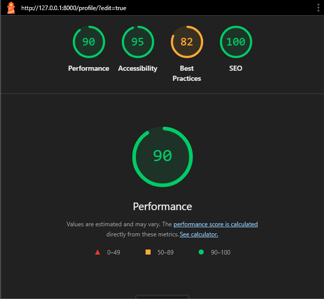
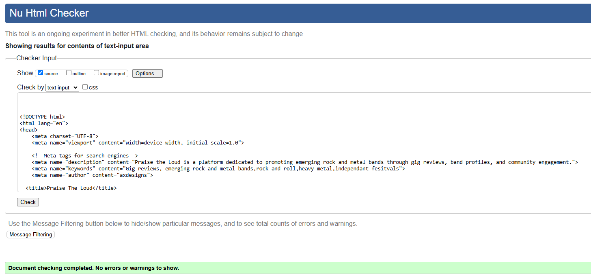

## 9. Testing
All functionality was tested manually by working through user stories. Testing was carried out in Google Chrome, Edge, Brave and Firefox across desktop and mobile screen sizes. DevTools were used to check responsiveness and console errors. Forms and dynamic elements were tested for validation, correct behaviour, and feedback.

### 9.1 User Stories

Different user stories, as listed in the README.md 1.2.1, have been combined into new stories that bring together the different, but similar, elements for testing purposes.

#### 9.1.1 What Was Tested

This user story covers the full flow of registration, profile creation, and social link input.

As a **fan**, I can **register an account** so that I can **create a profile**.

**Acceptance Criteria 1: Register an account**
- [x] Register page loads without errors and shows a *Hello User* message in navbar
- [x] All required fields (username, email, password) are present
- [x] Password confirmation matches check is working
- [x] Error messages appear for duplicate usernames or mismatched passwords

**Acceptance Criteria 2: Create a profile**
- [x] After registering, the user can navigate to a profile form
- [x] The form includes fields for bio, photo upload, and social links
- [x] Submitting the profile form creates a new Fan Profile linked to the user
- [x] Validation prevents submission of incomplete or empty required fields

**Acceptance Criteria 3: Add a photo and bio**
- [x] File upload works (tested with PNG and JPG)
- [x] Image is uploaded to Cloudinary
- [x] Bio field saves and displays on the profile page

**Acceptance Criteria 4: Add links to Facebook and Instagram**
- [x] Fields for social media links are present and optional
- [x] Submitted links save correctly and are clickable
- [x] Links open in a new tab

**Tasks Completed**
- [x] Installed Django authentication with registration and login functionality
- [x] Created profile page with support for photo upload and bio
- [x] Added input fields for Facebook and Instagram links

**Notes**
Initial *Cloudinary* image uploads failed due to incorrect environment variable setup. This was resolved by configuring *'env.py'* and using *'CloudinaryField'* in the model. Also ran into an issue where the *JS* for delete confirmation didn't work due to broken static file paths — this was fixed by correcting the path with *''* and ensuring static files were served via *'urls.py'*.

#### 9.1.1.2 What Was Tested

As a **fan**, I can **view consistent and clearly styled password instructions** so that **I feel confident when setting up my account and know exactly what is required**.

**Acceptance Criteria 5: Password help text styling**

- [x] The password help text appears using *Django*’s default validation messages
- [x] Bullet points are removed using *CSS* without modifying *Django*’s logic
- [x] The spacing between the password input and help text matches the spacing on other fields
- [x] Help text is styled to match the form's colour scheme and font
- [x] No unwanted margin or list styling appears in the final rendered form
- [x] All password validation rules still apply on form submission

**Tasks Completed**

- [x] Reverted from using *CustomUserCreationForm* to *Django*’s built-in *UserCreationForm*
- [x] Applied *CSS* to style and space .helptext and remove list bullets
- [x] Tested signup page to ensure visual consistency and validator functionality remained intact

**Notes**
Originally attempted to override the password help text using a custom form and *p* tags for cleaner output. This was rolled back to preserve *Django*’s default behavior and reduce complexity, relying instead on *CSS* for full visual control.

#### 9.1.2 What Was Tested

This user story covers the ability for fans to edit or delete their profile, including image updates and confirmation before deletion.

As a **fan**, I want to **be able to update or delete my profile** so that **I can have full control over my presence on the website**.

**Acceptance Criteria 1: Profile form can be edited and updated**

- [x] Update button appears when viewing an existing profile  
- [x] Clicking the button loads the profile form with existing data  
- [x] Updating text fields and submitting saves changes correctly  
- [x] Success message is shown after update  

**Acceptance Criteria 2: Profile image can be changed**

- [x] Existing image is displayed on the update form  
- [x] Selecting a new image replaces the old one after submission  
- [x] Updated image is stored in *Cloudinary*  

**Acceptance Criteria 3: Update form shows existing profile data and changes are saved and displayed correctly**

- [x] All profile fields pre-fill with the user's current data  
- [x] Edited data persists after refresh  
- [x] Updated information is visible on the public-facing profile *(This was tested later in development, but included here as it part of this user story)*  

**Acceptance Criteria 4: Form deletion shows a pop-up warning before confirming deletion**

- [x] Delete button appears alongside the update button  
- [x] Clicking the delete button triggers a *JS* confirmation popup  
- [x] Profile is only deleted if user confirms  
- [x] User is redirected to homepage after deletion  

**Tasks Completed**

- [x] Created update and delete buttons in profile view  
- [x] Enabled image update functionality with *Cloudinary*  
- [x] Added confirmation message after update  
- [x] Implemented *JavaScript* delete confirmation popup  

**Notes**

The delete confirmation popup initially failed to appear after static files were moved to a global directory. This was resolved by fixing the path to *'scripts.js'* in *'base.html'* using *''* and confirming the file was being loaded by checking for a *'console.log'* message in the browser console.

#### 9.1.3 What Was Tested

This user story covers the fan login process, viewing an existing profile, and accessing the review form through the navigation bar.

As a **fan**, I can **login** so that I can **view my profile and leave a review**.

**Acceptance Criteria 1: Successfully log in**

- [x] Login page loads with fields for username and password  
- [x] Error messages appear for incorrect credentials  
- [x] Successful login redirects to the homepage or dashboard  
- [x] User session persists across navigation  

**Acceptance Criteria 2: View already created profile**

- [x] 'Profile' link is visible in the navigation bar after login  
- [x] Clicking the link shows the fan’s profile  
- [x] Profile displays correct image, bio, and social links  

**Acceptance Criteria 3: Navigate to the gig review form**

- [x] 'Gig Review' link appears in the navbar after login  
- [x] Clicking the link loads the review form page  
- [x] Form loads correctly and is accessible to logged-in users  

**Tasks Completed**

- [x] Created navigation bar with 'Profile' and 'Gig Review' links in *'base.html'*  
- [x] Used Django’s template inheritance to extend *'base.html'* across all pages  
- [x] Ensured navigation links only appear to logged-in users using template logic  

**Notes**

No major issues were encountered during testing. The login, profile access, and review navigation worked as expected. Session persistence and conditional display of nav links based on login state were verified through manual testing.

#### 9.1.4 What Was Tested

This user story covers the fan's ability to log in, navigate to the review form, write a review for an artist, and see the review immediately appear on their profile page after submission.

As a **fan**, I can **log in** so that **I can leave a review for the artist**.

**Acceptance Criteria 1: Navigate to the gig review form**

- [x] 'Gig Review' link appears in the navigation bar after login  
- [x] Clicking the link loads the review form  
- [x] Form is only accessible to logged-in users  

**Acceptance Criteria 2: Write review**

- [x] Form contains fields for artist, venue, date, title, photo and review text
- [x] Date field uses a browser-native calendar picker 
- [x] User can select a gig date without typing manually  

**Acceptance Criteria 3: Submit review and view it on profile**

- [x] Review is saved to the database  
- [x] User is redirected to their profile page after submission  
- [x] Submitted review appears immediately on the profile page  

**Tasks Completed**

- [x] Created form using Django's *'ModelForm'* for the *'GigReview'* model  
- [x] Set *'type="data"'* for the gig date widget  
- [x] Added *'imput_formats'* to match browser submission format  
- [x] Ensured review appears on profile page after submission  

**Notes**

The review form initially rejected valid dates with a *“Enter a valid date”* error because the input format was incorrectly set. This was corrected to to match the format sent by the browser's calendar picker. After this fix, the form submitted successfully and the review appeared immediately on the profile page.

#### 9.1.5 What Was Tested

This user story covers the fan’s ability to view reviews associated with an artist, displayed directly beneath the artist's bio after selecting them from the search bar.

As a **fan**, I can **view artist reviews** so that **I can see what others think about their performances**.

**Acceptance Criteria 1: Search for artist profile**

- [x] Search bar includes an option to select “artist”
- [x] Entering a valid artist name displays the correct artist bio
- [x] Artist details appear at the top of the results section

**Acceptance Criteria 2: Display associated reviews**

- [x] Reviews appear directly below the artist bio
- [x] Only reviews linked to the selected artist are shown
- [x] No other artists’ reviews are displayed

**Acceptance Criteria 3: Responsive layout**

- [x] Review section layout remains consistent across screen sizes
- [x] Reviews remain visually grouped with the artist bio on mobile and desktop
- [x] No overlapping or broken layout issues were found

**Tasks Completed**

- [x] Verified context data passed artist and related reviews correctly to the template
- [x] Placed reviews section directly after the bio block in the HTML structure
- [x] Checked that the reviews used the correct foreign key relationship to the artist

**Notes**

The reviews were initially not appearing under the artist bio due to incorrect template placement and a missing query for related reviews. After adjusting the HTML structure and passing the correct context, the reviews displayed in the right location and matched the selected artist as intended.

#### 9.2 Manual Testing

For the testing of the website, I followed the exact same process I did for project 1 ans 2, as it seemed to be the most robust way of testing my project. I intend to use this same process for all my projects, both for the course material as well as any future work I undertake - albeit with additional practices as I learn more languages, tools and practices.

As I went along, I tested the website on my phone and laptop using both *Google* and *Brave* (a *Google* based browser), as well as testing it in *MS Edge* on my work laptop. I tested the site for responsiveness continually in *Google* and *Brave* and made the necessary changes to my *style.css* file using media queries to improve performance. I tested it in *Ms Edge* very occasionally, as it is not a browser I like using, but did so to make sure there were no errors that did not show up in *Google* or *Brave*. Other than my own testing two separate methods were also used for testing purposes: informal and formal testing.

#### 9.2.1 Informal manual (live)

Testing was done through friends and family who use different OS and devices, for feedback. In particular my girlfriend tested the site on *Firefox* on her laptop and on her mobile (which dates back to a pre-2018 model). 

My parents tested the site on their *Google* tablet and *Amazon Kindle*. 4 close friends tested the site on the different *Apple* devices (2 phones and 1 laptop) and a work colleague ran it through *MS Edge* as he wanted to keep up to date with the changes as I went along. My work colleague was very polite, but he did send me screen shots when he had questions about the development of the website.

This was incredibly useful as it gave me a full understanding of each user experience. As this core group is very close to me their feedback was honest and to the point, which was both frustrating and extremely valuable.

Formal (automated) testing of the website was validated using the W3C Validation tools.

#### 9.2.1 What Was Tested - User Experience at COTW

Tests were conducted at the *Call of the Wild Festival (COTW)*, at *Lincoln Showground*s between Friday the 30th of May to Sunday the 01st of June. I asked Five friends to set up fake profiles and submitted reviews on the app. I asked them to use it naturally in a live music setting and report anything they found confusing, broken, difficult and to give some general feedback.

Testing Devices used:
- Mobiles (iPhone 12, iPad, Galaxy S20, Motorola Edge, iPhone XR)
- OS (Windows, Chrome and Safari)

- [x] Tested the app in a live music setting at Call of the Wild Festival
- [x] Collected detailed feedback from Paul, Paul B., Dave, Steph and Julie
- [x] Reviewed screenshots from Julie to identify UI/UX issues
- [x] Compiled feedback into actionable criteria for future testing

**Feedback Summary:**

Paul pointed out that putting spaces in the username during profile setup caused the page to reload without a clear error message. He also noted that his uploaded review image appeared oversized on mobile, requiring multiple swipes to scroll past. Additionally, he felt the review text box was too small, lacking a visible character limit and cutting his input short.

Dave had issues uploading photos, receiving an error that there wasn’t enough memory. He also mentioned that “Lesbian Bed Death” was missing from the band list, and “Brave Revival” was not listed either. He suggested it may be helpful to allow users to suggest bands if admin-only entry is the current setup. Overall, he found the app simple and easy to use.

Julie submitted a review but said the submit button behaved oddly, and her uploaded photo also displayed strangely. She confirmed the text input cut her off before she could finish her thought and suggested there may be a character limit issue. When asked, she said she preferred to avoid “waffle” but still needed room to round off the review properly. She also sent screenshots of the odd behavior for further analysis.

Steph chose not to setup a profile and decided that she would have a look later when the others had created their reviews to see what it all looked like. She never did give any feedback.

Paul B. only created a profile after the festival and submitted one review. His only feedback was; "you still have some work to do!".

**Profile Setup**

- [x] Users should be informed if their chosen username is invalid (clear error message)
- [x] Profile creation page should provide helpful error feedback
- [x] Users can upload a profile image

**Review Submission**

- [x] Review form should accept and store text input
- [x] Review form should allow enough text to feel complete without being too long
- [x] Image uploads should scale correctly for mobile
- [x] Users should be able to select a band from a list
- [x] Review submission button should be consistently responsive
- [x] Image upload should work smoothly without memory issues

**Actional Criteria**

- Profile Setup
  - [x] Add validation feedback for username errors (e.g. if spaces are included)
  - [x] Ensure the profile creation page clearly highlights and explains any input errors

- Review Submission

  - [x] Increase character limit slightly to allow more complete thoughts
  - [x] Ensure uploaded images are automatically resized or scaled down for mobile viewing
  - [x] Investigate and fix memory-related issues with photo uploads (possibly related to file size or client-side limitations)
  - [x] Improve feedback or retry logic when review submission fails or button misbehaves

These were then turned into actionable criteria for future testing as *'Github Issues'* and *'Issues'* in the project repository.

#### 9.2.2 Automated Testing

Formal (automated) testing of the website was validated using the *W3C Validation* tools and *Lighthouse*.

#### 9.3.1 LightHouse

Below are the performance, Accessibility, Best Priocatice and SEO results for each page. For the most part Accessibility and SEO scored very well and remained in the 'green'. However, there were mixed resilts for Performance and Best Practices with both going from 'green' to 'yellow'. Most of the issues were due to image size and *Bootstrap* performance and rendering, which beyond the capability of this developer at this stage. Having said that, had there been more time all images would have been compressed. It is noted that with a website of this sort, where there are a lot of photos as well as logos, their size is paramount to the overall performance and best practices of the site.

##### 9.3.1.1 Home Page

##### 9.3.1.2 About Page

##### 9.3.1.3 Wall of Chaos (Gallery)

##### 9.3.1.4 Login Page

##### 9.3.1.5 Sign Up Page

##### 9.3.1.6 Contact Page

##### 9.3.1.7 Profile Page

##### 9.3.1.7.1 Profile Edit Page

##### 9.3.1.8 Gig Review Form Page

##### 9.3.1.9 Author's Profile Page

The bearded_clam's public profile page was used here.

##### 9.3.1.10 Artist Profile Page

DeadFire's profile page was used here.

##### 9.3.1.11 Venue Page

##### 9.3.1.11 Search Result Page

Both the Artist and Venue search results were tested with the letter 'o'.

##### 9.3.1.11.1 Artist Search Results

##### 9.3.1.11.2 Venue Search Results

##### 9.3.2 CSS Validation

*CSS* validation was completed using *W3C CSS Validator**. The warnings shown below are the 'forces' that were used to minipulate browser defaults.

##### 9.3.3 HTML Validation

Below are the results for each of the *HTML* pages in the website and their corrresponding results using *W3C Markup Validator*.

##### 9.3.3.1 Home Page

##### 9.3.3.2 About Page

##### 9.3.3.3 Wall of Chaos (Gallery)

##### 9.3.3.4 Login Page

##### 9.3.3.5 Sign Up Page

##### 9.3.3.6 Contact Form

##### 9.3.3.7 Profile Page

##### 9.3.3.7.1 Profile Edit Page

##### 9.3.3.8 Gig Review Form Page

##### 9.3.3.9 Logout Page

##### 9.3.3.10 Author's Profile Page

The bearded_clam's public profile page was used here.

##### 9.3.3.13 Artist Profile Page

DeadFire's profile page was used here.

##### 9.3.1.11 Venue Page

##### 9.3.1.11 Search Result Page

Both the Artist and Venue search results were tested with the letter 'o'.

##### 9.3.1.11.1 Artist Search Results

##### 9.3.1.11.2 Venue Search Results

##### 9.3.4 Responsive Testing

<a href="https://www.loom.com/share/072b48ab6a764abfabc4c80485969133?sid=cd73abe2-9e82-46ed-b8c0-dedd9a8b72b1" target="_blank">Watch responsive video</a>

##### 9.3.5 JSHint

